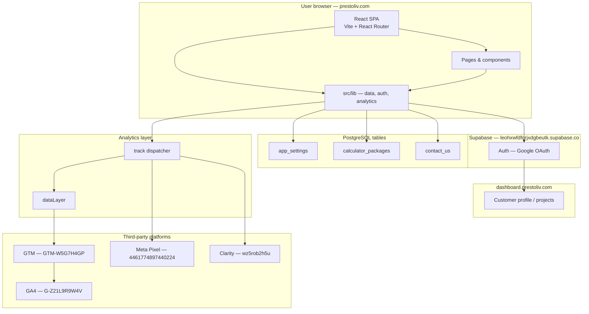
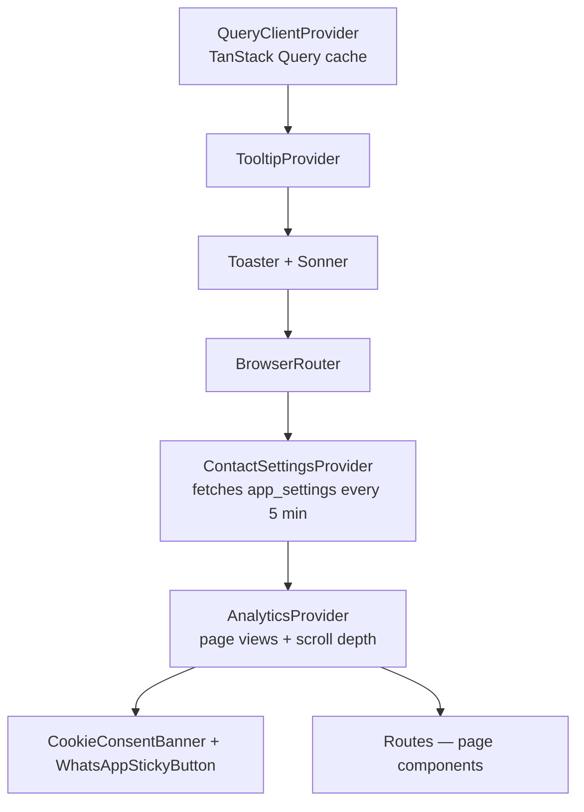
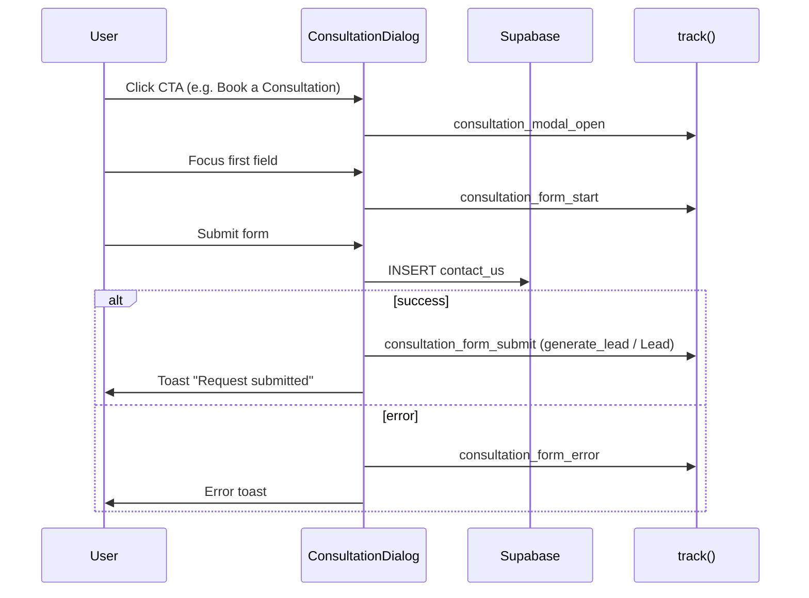
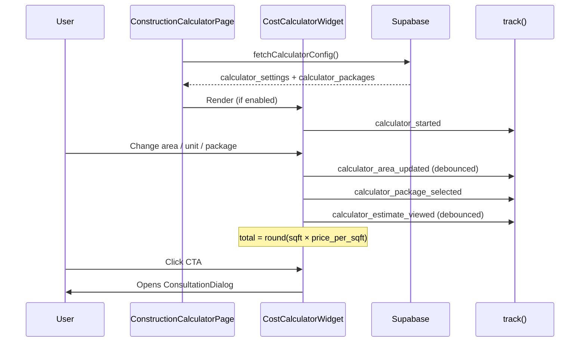
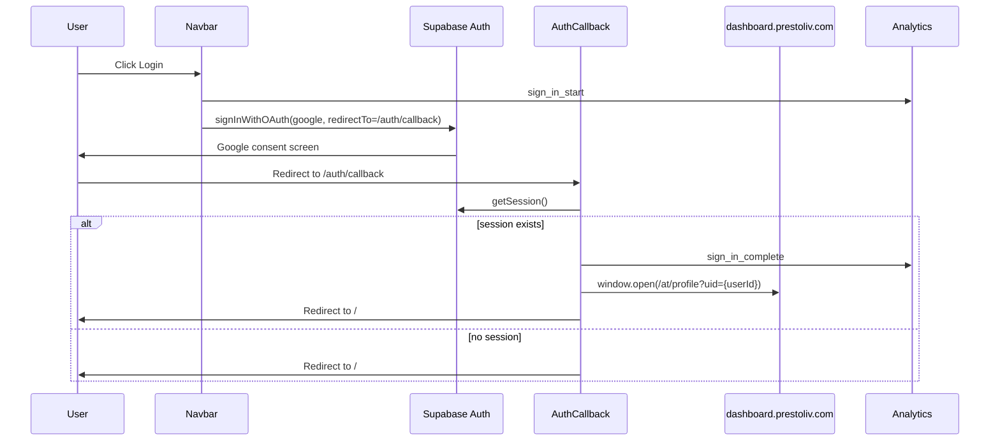

# Prestoliv Marketing Website — Structure, Schema & Architecture

**Audience:** Marketing, growth, social, and non-technical stakeholders (with technical accuracy for engineering)  
**Last updated:** June 2026  
**Scope:** Repo-inferred only — database types, RLS policies, and infrastructure details not present in this repository are marked **UNKNOWN**.

**Related docs:**
- [Marketing & Growth Team Guide](./MARKETING_AND_GROWTH_TEAM_GUIDE.md)
- [Analytics Reference](./ANALYTICS.md)

---

## Table of contents

1. [Executive summary](#1-executive-summary)
2. [System architecture](#2-system-architecture)
3. [Repository structure](#3-repository-structure)
4. [Technology stack](#4-technology-stack)
5. [Environment variables](#5-environment-variables)
6. [Frontend runtime architecture](#6-frontend-runtime-architecture)
7. [Database schema (repo-inferred)](#7-database-schema-repo-inferred)
8. [Core business flows](#8-core-business-flows)
9. [Analytics architecture](#9-analytics-architecture)
10. [Maintenance & change workflow](#10-maintenance--change-workflow)
11. [Known gaps & unknowns](#11-known-gaps--unknowns)
12. [Appendices](#12-appendices)

---

## 1. Executive summary

### What this project is

**prestoliv.com** is a **marketing website** for Prestoliv — a home construction and interior design company in Hyderabad. It is built as a **Single Page Application (SPA)**: users navigate between pages (Home, Services, Calculator, etc.) without full browser reloads.

### What it does for the business

| Capability | Business value |
|------------|----------------|
| **Lead capture** | “Book a consultation” form saves enquiries to the database |
| **Cost calculator** | Instant construction cost estimates to drive mid-funnel intent |
| **Service pages** | Residential, commercial, and interior design landing pages |
| **Google login** | Lets existing customers open their project dashboard |
| **Analytics** | Tracks every CTA, form step, and calculator action for campaign optimization |
| **Dynamic settings** | Phone, WhatsApp, and calculator content managed from Supabase (no code deploy) |

### External systems

| System | Role |
|--------|------|
| **Supabase** | Database (leads, settings, packages), Google OAuth authentication |
| **dashboard.prestoliv.com** | Customer project dashboard (separate app; opened after login) |
| **Google Tag Manager** | Central hub for GA4 and future marketing tags |
| **Google Analytics 4** | Traffic, funnels, conversions |
| **Meta Pixel** | Facebook/Instagram ads optimization and retargeting |
| **Microsoft Clarity** | Session recordings and heatmaps |

### Plain-language data flow

1. Visitor browses the website in their browser.
2. When they submit a consultation form, data is saved to **Supabase** (`contact_us` table).
3. At the same time, **analytics events** fire to GTM, GA4, and Meta — without sending name/phone to ad platforms.
4. Calculator prices and contact numbers are **read from Supabase** on page load (with hardcoded fallbacks if the database is unreachable).

---

## 2. System architecture

### 2.1 High-level component diagram



**Key design choices:**
- **No custom backend server** in this repo — the browser talks directly to Supabase using the public anon key (with Row Level Security on the database side; policies are **UNKNOWN** in this repo).
- **GA4 runs through GTM only** when `VITE_GTM_ID` is set — avoids double-counting page views.
- **Meta Pixel loads directly** on the site (parallel to GTM) for reliable conversion tracking.

### 2.2 End-to-end user flows

```mermaid
flowchart LR
  subgraph LeadFlow["Lead funnel"]
    CTA[User clicks Book Consultation] --> MODAL[ConsultationDialog opens]
    MODAL --> FORM[User fills form]
    FORM --> INSERT[Supabase: contact_us INSERT]
    FORM --> EVT_LEAD[Analytics: consultation_form_submit]
    INSERT --> CRM[Lead in database]
    EVT_LEAD --> PIXELS[GTM / GA4 / Meta Lead]
  end

  subgraph CalcFlow["Calculator"]
    LOAD[User opens /calculator] --> FETCH[Fetch calculator_packages + app_settings]
    FETCH --> WIDGET[CostCalculatorWidget]
    WIDGET --> COMPUTE[Local: area × price_per_sqft]
    WIDGET --> EVT_CALC[Analytics: calculator_* events]
  end

  subgraph WhatsAppFlow["WhatsApp sticky button"]
    BOOT[App loads] --> CTX[ContactSettingsProvider]
    CTX --> READ[Fetch app_settings contact_settings]
    READ --> TOGGLE{whatsapp_enabled?}
    TOGGLE -->|yes| BTN[Show sticky WhatsApp button]
    TOGGLE -->|no| HIDE[Hide button]
  end

  subgraph AuthFlow["Google login"]
    LOGIN[User clicks Login] --> OAUTH[signInWithOAuth Google]
    OAUTH --> CB[/auth/callback]
    CB --> SESSION[getSession]
    SESSION --> DASH[Open dashboard.prestoliv.com/at/profile]
    SESSION --> EVT_AUTH[Analytics: sign_in_complete]
  end
```

---

## 3. Repository structure

```
prestoliv-code/
├── public/                 # Static assets (robots.txt, og-image.png)
├── src/
│   ├── main.tsx            # App entry point
│   ├── App.tsx             # Router, providers, global UI shell
│   ├── pages/              # One file per route (Index, About, Calculator, …)
│   ├── components/
│   │   ├── site/           # Marketing sections (Hero, Navbar, Faq, …)
│   │   ├── calculator/     # Cost calculator widget
│   │   ├── ui/             # shadcn/Radix UI primitives (Button, Dialog, …)
│   │   └── …               # Shared widgets (ConsultationDialog, AnalyticsProvider, …)
│   ├── lib/                # Business logic — Supabase, auth, analytics, SEO
│   ├── hooks/              # React hooks (scroll tracking, toast, mobile)
│   └── assets/             # Images, logo
├── supabase/
│   └── seed-contact-settings.sql   # Example SQL seed for contact_settings
├── docs/                   # Documentation (this file, analytics, marketing guide)
├── gtm/                    # GTM import JSON + tag catalog
├── scripts/                # GTM generator (npm run gtm:generate)
├── index.html              # HTML shell, consent defaults, OG tags, JSON-LD
├── package.json
├── vite.config.ts
└── tailwind.config.ts
```

### Folder responsibilities

| Folder | Purpose |
|--------|---------|
| `src/pages/` | **Route-level pages** — each maps to a URL in `App.tsx` |
| `src/components/site/` | **Marketing sections** — Hero, Services, FAQ, footer CTA |
| `src/components/calculator/` | **Calculator UI** — widget, package cards, formatting |
| `src/components/ui/` | **Design system** — reusable buttons, dialogs, forms (shadcn/ui) |
| `src/lib/` | **Core logic** — Supabase client, settings parsers, analytics dispatcher, SEO |
| `src/hooks/` | **React hooks** — scroll depth tracking, responsive helpers |
| `supabase/` | **Database artifacts** — seeds only in this repo (no migrations) |
| `gtm/` | **GTM container** — importable JSON + human-readable tag catalog |
| `docs/` | **Stakeholder & developer documentation** |

**Rule of thumb:** UI components in `components/` are mostly presentation. Data fetching, parsing, and side effects live in `src/lib/*` or dedicated providers (`ContactSettingsProvider`).

---

## 4. Technology stack

| Layer | Technology | Version (approx.) | Source |
|-------|------------|-------------------|--------|
| **Runtime** | Node.js + npm | — | `package.json` |
| **Build tool** | Vite | 5.x | `vite.config.ts` |
| **Language** | TypeScript | 5.x | `tsconfig.json` |
| **UI framework** | React | 18.x | `package.json` |
| **Routing** | React Router DOM | 6.x | `src/App.tsx` |
| **Styling** | Tailwind CSS | 3.x | `tailwind.config.ts` |
| **Component library** | shadcn/ui + Radix UI | — | `src/components/ui/` |
| **Animations** | Framer Motion | 12.x | Navbar, calculator |
| **Forms** | React Hook Form + Zod | — | `package.json` |
| **Server state** | TanStack React Query | 5.x | `ContactSettingsProvider` |
| **Backend / DB** | Supabase (PostgreSQL + Auth) | JS client 2.x | `src/lib/supabase.ts` |
| **SEO** | react-helmet-async | 3.x | `src/main.tsx`, `PageMeta` |
| **Analytics** | Custom layer → GTM, GA4, Meta, Clarity | — | `src/lib/analytics/` |
| **Testing** | Vitest + Testing Library | 3.x | `src/test/` |
| **Dev server** | Port 8080 | — | `vite.config.ts` |

### Build & scripts

| Command | Purpose |
|---------|---------|
| `npm run dev` | Start local dev server (port 8080) |
| `npm run build` | Production build to `dist/` |
| `npm run preview` | Preview production build |
| `npm run lint` | ESLint |
| `npm run test` | Vitest unit tests |
| `npm run gtm:generate` | Regenerate `gtm/prestoliv-analytics-import.json` |

---

## 5. Environment variables

All client-side variables use the `VITE_` prefix (exposed to the browser by Vite).

| Variable | Consumed by | Purpose |
|----------|-------------|---------|
| `VITE_SUPABASE_URL` | `src/lib/supabase.ts` | Supabase project URL |
| `VITE_SUPABASE_ANON_KEY` | `src/lib/supabase.ts` | Public anon key for browser client |
| `VITE_DASHBOARD_URL` | `src/lib/dashboard.ts` | Customer dashboard origin (default: `https://dashboard.prestoliv.com`) |
| `VITE_GTM_ID` | `src/lib/analytics/core.ts` | Google Tag Manager container ID |
| `VITE_GA_MEASUREMENT_ID` | `src/lib/analytics/core.ts` | Direct GA4 (leave **empty** when GTM is active) |
| `VITE_META_PIXEL_ID` | `src/lib/analytics/core.ts` | Meta (Facebook) Pixel ID |
| `VITE_CLARITY_PROJECT_ID` | `src/lib/analytics/core.ts` | Microsoft Clarity project ID |

### Production checklist

```
VITE_SUPABASE_URL=<supabase-project-url>
VITE_SUPABASE_ANON_KEY=<supabase-anon-key>
VITE_DASHBOARD_URL=https://dashboard.prestoliv.com
VITE_GTM_ID=GTM-W5G7H4GP
VITE_META_PIXEL_ID=4461774897440224
VITE_CLARITY_PROJECT_ID=wz5rob2h5u
# Leave empty — GA4 runs inside GTM:
VITE_GA_MEASUREMENT_ID=
```

**Note:** Never commit secrets to git. `.env` is local only; production values live in the hosting provider (e.g. Vercel).

---

## 6. Frontend runtime architecture

### 6.1 Boot sequence

```
index.html
  └── consent defaults (gtag consent denied until user accepts)
  └── dataLayer initialized
  └── /src/main.tsx
        └── HelmetProvider (SEO head tags)
              └── App.tsx
```

**Source:** `index.html`, `src/main.tsx`

### 6.2 Provider hierarchy

From outermost to innermost (`src/App.tsx`):



| Provider / component | Responsibility |
|---------------------|----------------|
| `QueryClientProvider` | Caches Supabase reads (contact settings) |
| `ContactSettingsProvider` | Loads `contact_settings` from `app_settings`; exposes via React context |
| `AnalyticsProvider` | Loads GTM/Meta/Clarity scripts; fires `virtual_page_view` on route change |
| `CookieConsentBanner` | GDPR-style consent; grants analytics storage on accept |
| `WhatsAppStickyButton` | Floating WhatsApp CTA (hidden when `whatsapp_enabled` is false) |
| `ScrollToTop` | Scrolls to top on route change |

### 6.3 Route map

| Path | Page component | Purpose |
|------|----------------|---------|
| `/` | `Index` | Homepage |
| `/process` | `Process` | Construction process |
| `/services` | `OurServices` | Services hub |
| `/services/residential` | `ResidentialPage` | Residential construction |
| `/services/commercial` | `CommercialPage` | Commercial construction |
| `/services/interiors` | `InteriorsPage` | Interior design |
| `/calculator` | `ConstructionCalculatorPage` | Cost calculator |
| `/about` | `About` | About Prestoliv |
| `/auth/callback` | `AuthCallback` | Google OAuth return URL |
| `*` | `NotFound` | 404 page |

**Source:** `src/App.tsx`

### 6.4 Key shared components

| Component | File | Role |
|-----------|------|------|
| `ConsultationDialog` | `src/components/ConsultationDialog.tsx` | Lead form modal — inserts into `contact_us` |
| `Navbar` | `src/components/site/Navbar.tsx` | Navigation, login, consultation CTA |
| `CostCalculatorWidget` | `src/components/calculator/CostCalculatorWidget.tsx` | Interactive calculator |
| `PageMeta` / `PageSeoFromPath` | `src/components/PageMeta.tsx` | Per-route title, description, OG tags |
| `CtaFooter` | `src/components/site/CtaFooter.tsx` | Bottom CTA band on most pages |

---

## 7. Database schema (repo-inferred)

> **Important:** This repository does **not** contain Supabase migrations or `CREATE TABLE` statements. The schema below is **inferred from application code** and one SQL seed file. Column types, primary keys, indexes, RLS policies, and triggers are marked **UNKNOWN** unless explicitly seen in code.

### 7.1 Entity relationship (inferred)

```mermaid
erDiagram
  app_settings {
    text key PK_UNKNOWN
    jsonb value
  }
  calculator_packages {
    text id PK_UNKNOWN
    text label
    text description
    numeric price_per_sqft
    text badge
    boolean highlight
    text color
    boolean enabled
    integer sort_order
  }
  contact_us {
    text name
    text phone
    text email
    text city
    text service
    text other_service
  }

  app_settings ||--o{ contact_settings : "key = contact_settings"
  app_settings ||--o{ calculator_settings : "key = calculator_settings"
```

### 7.2 Table: `app_settings`

**Purpose:** Key-value store for site-wide configuration. Marketing and ops can update values in Supabase without redeploying the website.

**Access pattern:** `SELECT value WHERE key = ?` (read-only from the marketing site)

| Column | Inferred type | Description |
|--------|---------------|-------------|
| `key` | text (**UNKNOWN** PK/unique) | Setting identifier |
| `value` | jsonb | JSON payload for that key |

**Known keys:**

#### `contact_settings`

**Seed:** `supabase/seed-contact-settings.sql`  
**Reader:** `src/lib/contactSettings.ts` → `fetchContactSettings()`

| JSON field | Type | Example | Used for |
|------------|------|---------|----------|
| `whatsapp_number` | string (digits) | `919849078569` | WhatsApp link (`wa.me/…`) |
| `phone_e164` | string | `+919849078569` | `tel:` links in footer |
| `phone_display` | string | `+91 98490 78569` | Human-readable phone label |
| `whatsapp_enabled` | boolean | `true` | Show/hide sticky WhatsApp button |

**Fallback:** If Supabase read fails, `DEFAULT_CONTACT_SETTINGS` in code is used.

#### `calculator_settings`

**Reader:** `src/lib/calculatorConfig.ts` → `fetchCalculatorConfig()`

| JSON field | Type | Purpose |
|------------|------|---------|
| `enabled` | boolean | Turn calculator page on/off |
| `default_area` | number | Default built-up area (e.g. 1500) |
| `default_unit` | `"sqft"` \| `"sqm"` | Default unit toggle |
| `sqm_to_sqft_factor` | number | Conversion factor (default 10.764) |
| `show_estimate_range` | boolean | Show low/high estimate band |
| `low_variance_pct` | number | Low estimate variance (e.g. 0.05) |
| `high_variance_pct` | number | High estimate variance |
| `hero_eyebrow` | string | Calculator page eyebrow text |
| `hero_title` | string | Calculator page headline |
| `hero_subtitle` | string | Calculator page subhead |
| `area_section_title` | string | Area input section title |
| `area_section_help` | string | Area input help text |
| `packages_section_title` | string | Packages section title |
| `packages_section_subtitle` | string | Packages section subtitle |
| `per_sqft_label` | string | Label for rate (e.g. "per sq ft") |
| `estimated_total_label` | string | Estimate card label |
| `cta_eyebrow` | string | Bottom CTA eyebrow |
| `cta_title` | string | Bottom CTA headline |
| `cta_subtitle` | string | Bottom CTA body |
| `cta_button` | string | CTA button label (e.g. "Book a Free Consultation") |

**Validation:** `parseSettings()` in `calculatorConfig.ts` coerces types and falls back to `DEFAULT_CALCULATOR_SETTINGS`.

---

### 7.3 Table: `calculator_packages`

**Purpose:** Construction package tiers (Basic, Classic, Premium, Royal) with per-sqft pricing.

**Access pattern:**
```sql
SELECT * FROM calculator_packages
WHERE enabled = true
ORDER BY sort_order ASC, id ASC
```
**Source:** `src/lib/calculatorConfig.ts`

| Column | Inferred type | Required | Description |
|--------|---------------|----------|-------------|
| `id` | text | yes | Package identifier (e.g. `basic`, `classic`) |
| `label` | text | yes | Display name |
| `description` | text | no | Package description |
| `price_per_sqft` | numeric | yes | Rate in INR per square foot |
| `badge` | text | no | Badge text (e.g. "Most popular") |
| `highlight` | boolean | no | Default-selected package |
| `color` | text | no | Tailwind color class (e.g. `bg-brand`) |
| `enabled` | boolean | yes | Filter — only enabled rows are shown |
| `sort_order` | integer | yes | Display order |

**Fallback:** If query fails or returns no rows, `FALLBACK_PACKAGES` hardcoded array in `calculatorConfig.ts` is used.

**Estimate formula (client-side, not stored in DB):**
```
total_inr = round(built_up_sqft × price_per_sqft)
built_up_sqft = area (if sqft) else area × sqm_to_sqft_factor
```

---

### 7.4 Table: `contact_us`

**Purpose:** Stores consultation / lead form submissions.

**Access pattern:** `INSERT` only from the marketing site  
**Source:** `src/components/ConsultationDialog.tsx`

| Column | Inferred type | Required | Description |
|--------|---------------|----------|-------------|
| `name` | text | yes | Full name |
| `phone` | text | yes | Phone number |
| `email` | text | no | Email (nullable) |
| `city` | text | yes | City / town |
| `service` | text | yes | One of: `residential`, `commercial`, `renovation`, `others` |
| `other_service` | text | no | Free text when `service = 'others'` |

**Columns UNKNOWN (not in insert payload):** `id`, `created_at`, `status`, `assigned_to`, etc.

**Privacy:** Name and phone are saved to Supabase only. Analytics events send `service_type`, `city`, and `has_email` — **not** name or phone. See `trackConsultationLead()` in `src/lib/analytics/core.ts`.

---

### 7.5 Supabase Auth (not a custom table)

**Provider:** Google OAuth  
**Client:** `src/lib/supabase.ts`

| Operation | Where |
|-----------|-------|
| `signInWithOAuth({ provider: 'google' })` | `Navbar.tsx` |
| `getSession()` | `Navbar.tsx`, `AuthCallback.tsx`, `auth.ts` |
| `exchangeCodeForSession(code)` | `auth.ts` (PKCE flow) |
| `onAuthStateChange` | `Navbar.tsx` |

**User object fields used:** `session.user.id` → passed to dashboard URL as `?uid=`

**Auth tables (managed by Supabase):** `auth.users`, etc. — **UNKNOWN** details; not queried directly from this app.

---

## 8. Core business flows

### 8.1 Consultation / lead funnel

**Business goal:** Capture qualified leads from any CTA on the site.



| Step | `lead_source` examples | Component |
|------|------------------------|-----------|
| Homepage hero | `hero` | `Hero` |
| Navbar desktop | `navbar_desktop` | `Navbar` |
| Navbar mobile | `navbar_mobile` | `Navbar` |
| Services dropdown | `navbar_services_menu` | `Navbar` |
| Footer band | `footer_cta` | `CtaFooter` |
| Calculator sidebar | `calculator_sidebar` | `CostCalculatorWidget` |
| Calculator page | `calculator_page_hero`, `calculator_bottom` | `ConstructionCalculatorPage` |
| Service pages | `service_residential`, `service_commercial`, `service_interiors` | Service pages |

**Form fields:** Name*, Phone*, Email (optional), City*, Service*, Other service (if "Others")

**Database write:**
```typescript
supabase.from("contact_us").insert({
  name, phone, email, city, service, other_service
})
```

---

### 8.2 Calculator flow

**Business goal:** Give instant construction cost estimates; drive users to book a consultation.



| Stage | What happens |
|-------|--------------|
| **Boot** | `fetchCalculatorConfig()` parallel-fetches packages + settings |
| **Disabled** | If `calculator_settings.enabled === false`, show "unavailable" state |
| **Fallback** | If packages query fails, use `FALLBACK_PACKAGES` (4 tiers, hardcoded rates) |
| **Interaction** | Area slider 300–15,000; unit toggle sqft/sqm; package cards |
| **CTA** | Multiple `ConsultationDialog` entry points with `lead_source` attribution |

---

### 8.3 Google OAuth → dashboard

**Business goal:** Let logged-in customers open their project dashboard.



**Dashboard URL pattern:**
```
{VITE_DASHBOARD_URL}/at/profile?uid={userId}
```
Default: `https://dashboard.prestoliv.com/at/profile?uid=…`

**Logged-in UI:** Navbar shows "View Dashboard" instead of "Login".

---

### 8.4 WhatsApp & contact settings

**Business goal:** Provide a persistent WhatsApp chat entry point; allow ops to change numbers without deploy.

| Step | Detail |
|------|--------|
| 1 | `ContactSettingsProvider` calls `fetchContactSettings()` on app load |
| 2 | Reads `app_settings` where `key = 'contact_settings'` |
| 3 | Parses JSON → React context (`useContactSettings()`) |
| 4 | `WhatsAppStickyButton` checks `whatsappEnabled` — renders null if false |
| 5 | Cache: TanStack Query `staleTime: 5 minutes` |

**Note:** `WhatsAppStickyButton` currently uses a hardcoded `WHATSAPP_URL` constant; `buildWhatsAppUrl()` exists in `contactSettings.ts` for dynamic URLs — potential improvement to wire them together.

---

## 9. Analytics architecture

### 9.1 Overview

All tracking flows through a **single dispatcher** (`track()` in `src/lib/analytics/core.ts`):

1. Push structured payload to `window.dataLayer` (for GTM)
2. Optionally call `gtag()` (GA4 direct — only if GTM is not hub)
3. Optionally call `fbq()` (Meta Pixel)

**Initialization:** `AnalyticsProvider` calls `initAnalyticsScripts()` once, then `trackPageView()` on every route change.

### 9.2 Platforms & loading

| Platform | Env var | Load method |
|----------|---------|-------------|
| GTM | `VITE_GTM_ID` | Script injection + noscript iframe |
| GA4 | Via GTM | `GA4 | Configuration` tag, `send_page_view: false` |
| Meta Pixel | `VITE_META_PIXEL_ID` | Direct `fbevents.js` |
| Clarity | `VITE_CLARITY_PROJECT_ID` | Direct `clarity.ms` tag |

### 9.3 Consent gating

| Piece | Behavior |
|-------|----------|
| `index.html` | Sets gtag consent **denied** by default |
| `CookieConsentBanner` | Accept → `grantAllConsent()` + save `prestoliv_consent=accepted` in localStorage |
| Reject | Saves `prestoliv_consent=rejected`; tags may still load but consent stays denied |
| `applyStoredConsentOnLoad()` | Re-applies grant on return visits if previously accepted |

**Storage key:** `prestoliv_consent` (`src/lib/consent.ts`)

### 9.4 dataLayer contract

Every event pushed via `track()` includes:

| Field | Description |
|-------|-------------|
| `event` | Trigger name for GTM (e.g. `consultation_form_submit`) |
| `event_category` | `page`, `engagement`, `conversion`, `calculator`, `authentication`, `contact`, `social` |
| `event_action` | `open`, `submit`, `click`, `view`, … |
| `event_label` | Human-readable label when useful |
| `page_path` | Current URL path + query |
| `content_group` | Page bucket (`home`, `calculator`, `service_residential`, …) |
| `button_id` | Slugified button identifier for reporting |

**GTM-specific events** (via `pushGtmEvent()`) use a leaner schema — e.g. `form_start`, `cta_click`, `service_interest`, `phone_click`, `whatsapp_click`.

**Full variable list for GTM import:** see `scripts/generate-gtm-import.mjs` → `BASE_DLV_KEYS` (37+ data layer variables).

### 9.5 Key event catalog (summary)

| Event | Category | When | GA4 | Meta |
|-------|----------|------|-----|------|
| `virtual_page_view` | page | Route change | `page_view` | PageView |
| `consultation_modal_open` | conversion | Dialog opened | — | InitiateCheckout |
| `consultation_form_start` | conversion | First field focus | — | — |
| `consultation_form_submit` | conversion | Lead saved | `generate_lead` | Lead |
| `consultation_form_error` | conversion | Submit failed | — | — |
| `calculator_started` | calculator | Packages loaded | `view_item` | ViewContent |
| `calculator_package_selected` | calculator | Package picked | `select_item` | ViewContent |
| `calculator_area_updated` | calculator | Area changed | — | CalculatorEngagement |
| `scroll_depth` | engagement | 25/50/75/100% | — | ScrollDepth |
| `sign_in_start` | authentication | Login clicked | `login` | SignInStart |
| `sign_in_complete` | authentication | OAuth success | `login` | SignInComplete |
| `whatsapp_click` | contact | WhatsApp button | — | — |
| `navigation_click` | navigation | Internal link | `click` | — |

**Full catalog:** `src/lib/analytics/events.ts` → `ANALYTICS_EVENT_CATALOG`  
**Marketing view:** `docs/ANALYTICS.md`  
**GTM tag list:** `gtm/TAG_CATALOG.md` (134+ named GA4 tags)

### 9.6 Content groups (for reporting)

| Route | `content_group` |
|-------|-----------------|
| `/` | `home` |
| `/process` | `process` |
| `/about` | `about` |
| `/calculator` | `calculator` |
| `/services` | `services_hub` |
| `/services/residential` | `service_residential` |
| `/services/commercial` | `service_commercial` |
| `/services/interiors` | `service_interiors` |
| Other `/services/*` | `service_detail` |
| Else | `other` |

### 9.7 `lead_source` attribution

Every consultation event includes `lead_source` — use in GA4 explorations and Meta custom conversions to answer: *"Which button drove this lead?"*

See [§8.1](#81-consultation--lead-funnel) for the full list.

---

## 10. Maintenance & change workflow

### 10.1 Update contact / WhatsApp numbers

1. Open Supabase SQL Editor (or admin dashboard).
2. Update `app_settings` row where `key = 'contact_settings'`.
3. Example seed: `supabase/seed-contact-settings.sql`
4. Site picks up changes within 5 minutes (React Query cache) or on hard refresh.

### 10.2 Update calculator packages or copy

| What to change | Where |
|----------------|-------|
| Package prices, labels, order | `calculator_packages` table in Supabase |
| Calculator page copy, defaults, enable/disable | `app_settings` → `calculator_settings` JSON |
| Hardcoded fallback packages | `FALLBACK_PACKAGES` in `src/lib/calculatorConfig.ts` (code deploy) |

### 10.3 Add or change analytics events

1. Add event name to `ANALYTICS_EVENTS` in `src/lib/analytics/events.ts`.
2. Add `trackXxx()` function in `src/lib/analytics/core.ts`.
3. Call tracker from the relevant component.
4. Regenerate GTM container:
   ```bash
   npm run gtm:generate
   ```
5. Import updated `gtm/prestoliv-analytics-import.json` → GTM Admin → Import → Merge → **Publish**.
6. Test with GTM Preview mode (see `gtm/IMPORT.txt`).

### 10.4 Deploy checklist

- [ ] Env vars set on hosting provider
- [ ] `VITE_GA_MEASUREMENT_ID` empty when GTM is active
- [ ] GTM container published (not just saved)
- [ ] Supabase `app_settings` and `calculator_packages` populated
- [ ] RLS policies allow anon INSERT on `contact_us` and SELECT on settings tables (**verify in Supabase — UNKNOWN in repo**)

---

## 11. Known gaps & unknowns

| Item | Status | Notes |
|------|--------|-------|
| **Database migrations** | UNKNOWN | No `supabase/migrations/` in repo; schema inferred from code |
| **Column SQL types** | UNKNOWN | Inferred as text/jsonb/boolean/numeric from usage |
| **Primary keys & indexes** | UNKNOWN | Not defined in repo |
| **RLS policies** | UNKNOWN | Must exist in Supabase for anon key security; verify with engineering |
| **`contact_us` extra columns** | UNKNOWN | `id`, `created_at`, status fields not in insert payload |
| **`AuthHashHandler`** | **Not wired** | Component exists (`src/components/AuthHashHandler.tsx`) but is **not mounted** in `App.tsx`. Handles OAuth redirects to `/#access_token=…` on site root — may fail silently today |
| **`AuthCallback` PKCE** | Partial | `AuthCallback.tsx` only calls `getSession()`; does not call `exchangeCodeForSession()`. PKCE handling lives in `auth.ts` but is only used by unused `AuthHashHandler` |
| **WhatsApp URL** | Hardcoded | `WhatsAppStickyButton` uses constant URL; `buildWhatsAppUrl()` from contact settings is not wired |
| **Meta CAPI** | Not implemented | Browser pixel only; server-side Conversions API is future work |
| **Hosting / CI** | UNKNOWN | Not defined in repo (likely Vercel per marketing docs) |
| **Dashboard app** | Separate repo | `dashboard.prestoliv.com` is out of scope for this codebase |

---

## 12. Appendices

### Appendix A — Route list

| Route | Page | SEO title (abbreviated) |
|-------|------|-------------------------|
| `/` | Home | Home Construction + 3D Walkthrough |
| `/process` | Process | Our Construction Process & 3D Walkthroughs |
| `/services` | Services hub | Construction & Interior Design Services |
| `/services/residential` | Residential | Residential Home Construction |
| `/services/commercial` | Commercial | Commercial Construction |
| `/services/interiors` | Interiors | Interior Design Services |
| `/calculator` | Calculator | Home Construction Cost Calculator |
| `/about` | About | About Prestoliv |
| `/auth/callback` | Auth | Signing In |
| `*` | 404 | Page Not Found |

**Source:** `src/lib/seo/pageTitles.ts`, `src/App.tsx`

### Appendix B — Tables summary

| Table | Read | Write | Keys / filters |
|-------|------|-------|----------------|
| `app_settings` | Yes | No (from site) | `key` ∈ `contact_settings`, `calculator_settings` |
| `calculator_packages` | Yes | No | `enabled = true`, order by `sort_order` |
| `contact_us` | No | INSERT | Lead form fields |
| `auth.users` | Via Auth API | OAuth only | Managed by Supabase |

### Appendix C — Environment variables

| Variable | Required | Example / notes |
|----------|----------|-----------------|
| `VITE_SUPABASE_URL` | Yes | `https://….supabase.co` |
| `VITE_SUPABASE_ANON_KEY` | Yes | Supabase anon public key |
| `VITE_DASHBOARD_URL` | No | Default `https://dashboard.prestoliv.com` |
| `VITE_GTM_ID` | Recommended | `GTM-W5G7H4GP` |
| `VITE_META_PIXEL_ID` | Recommended | `4461774897440224` |
| `VITE_CLARITY_PROJECT_ID` | Recommended | `wz5rob2h5u` |
| `VITE_GA_MEASUREMENT_ID` | No | Leave empty when GTM active |

### Appendix D — Source file index

| Topic | Primary files |
|-------|---------------|
| App entry & routes | `src/main.tsx`, `src/App.tsx` |
| Supabase client | `src/lib/supabase.ts` |
| Contact settings | `src/lib/contactSettings.ts`, `src/components/ContactSettingsProvider.tsx` |
| Calculator config | `src/lib/calculatorConfig.ts`, `src/components/calculator/CostCalculatorWidget.tsx` |
| Lead form | `src/components/ConsultationDialog.tsx` |
| Auth | `src/lib/auth.ts`, `src/components/site/Navbar.tsx`, `src/pages/AuthCallback.tsx` |
| Dashboard link | `src/lib/dashboard.ts` |
| Analytics | `src/lib/analytics/core.ts`, `src/lib/analytics/events.ts`, `src/components/AnalyticsProvider.tsx` |
| Consent | `src/lib/consent.ts`, `src/components/CookieConsentBanner.tsx` |
| SEO | `src/lib/seo/pageTitles.ts`, `src/components/PageMeta.tsx` |
| GTM generator | `scripts/generate-gtm-import.mjs`, `gtm/prestoliv-analytics-import.json` |
| DB seed | `supabase/seed-contact-settings.sql` |

---

**Document maintained by:** Engineering  
**For marketing/analytics questions:** See [MARKETING_AND_GROWTH_TEAM_GUIDE.md](./MARKETING_AND_GROWTH_TEAM_GUIDE.md)  
**For event-level detail:** See [ANALYTICS.md](./ANALYTICS.md)
