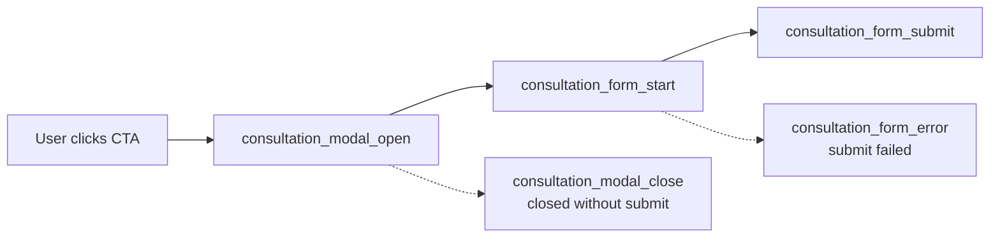

# Prestoliv Website — Marketing & Growth Team Guide

**Audience:** Marketing, growth, performance, and paid media teams  
**Purpose:** Explain what tracking and tagging were built on [prestoliv.com](https://www.prestoliv.com), how it connects to **Google Tag Manager (GTM)**, **Google Analytics 4 (GA4)**, **Meta (Facebook) Pixel**, and **Microsoft Clarity**, and how you can use the data for campaigns, reporting, and optimization.

**Last updated:** June 2026  
**Technical reference (developers):** [`docs/ANALYTICS.md`](./ANALYTICS.md)

---

## Table of contents

1. [Executive summary](#1-executive-summary)
2. [What was built (in plain language)](#2-what-was-built-in-plain-language)
3. [How the stack fits together](#3-how-the-stack-fits-together)
4. [Platform accounts & IDs](#4-platform-accounts--ids)
5. [Google Tag Manager (GTM)](#5-google-tag-manager-gtm)
6. [Google Analytics 4 (GA4)](#6-google-analytics-4-ga4)
7. [Meta Pixel (Facebook / Instagram ads)](#7-meta-pixel-facebook--instagram-ads)
8. [Microsoft Clarity](#8-microsoft-clarity)
9. [Lead funnel & attribution](#9-lead-funnel--attribution)
10. [Cost calculator tracking](#10-cost-calculator-tracking)
11. [Full event catalog (marketing view)](#11-full-event-catalog-marketing-view)
12. [Content groups (page reporting)](#12-content-groups-page-reporting)
13. [SEO & social sharing](#13-seo--social-sharing)
14. [How to test everything](#14-how-to-test-everything)
15. [Recommended Meta Ads setup](#15-recommended-meta-ads-setup)
16. [Recommended GA4 reports & explorations](#16-recommended-ga4-reports--explorations)
17. [Who owns what](#17-who-owns-what)
18. [FAQ](#18-faq)

---

## 1. Executive summary

The Prestoliv marketing website is a **single-page application (SPA)**—users move between pages (Home, Services, Calculator, etc.) without full browser reloads. Standard “drop a pixel in HTML” setups **miss most page views and conversions** on SPAs. We implemented a **unified analytics layer** that:

- Fires **accurate page views** on every route change  
- Tracks the **full consultation (lead) funnel** from button click → form open → form start → successful submit  
- Tracks **cost calculator engagement** (area, package, estimates) as mid-funnel intent signals  
- Sends the same events to **GTM (dataLayer)**, **GA4**, and **Meta Pixel** with consistent names  
- Tags every lead with a **`lead_source`** so you know *which button or page* drove the conversion  

**Bottom line for growth:** You can optimize Meta campaigns on real **Lead** and **InitiateCheckout** events, build GA4 funnels by page and CTA placement, and use Clarity to watch session recordings on high-traffic pages.

---

## 2. What was built (in plain language)

| Capability | Why it matters for marketing |
|------------|------------------------------|
| **GTM container** with importable config | Add/change tags without redeploying the website; central hub for GA4 |
| **GA4 via GTM** | Standard reporting, audiences, Google Ads linking, explorations |
| **Meta Pixel (direct on site)** | Conversion API companion, retargeting, campaign optimization |
| **SPA page view tracking** | Correct traffic by page in GA4 and Meta |
| **Scroll depth (25/50/75/100%)** | Content engagement; useful for landing page tests |
| **Consultation funnel events** | Full visibility from interest → lead |
| **`lead_source` on every consultation event** | Attribute leads to hero, navbar, footer, calculator, service pages |
| **Calculator events** | Identify high-intent users before they submit a form |
| **Navigation, CTA, FAQ, social, contact clicks** | Understand micro-conversions and content performance |
| **Google sign-in & dashboard clicks** | Measure logged-in user behavior (upper funnel / product interest) |
| **Microsoft Clarity** | Heatmaps and session replay for UX and landing page review |
| **GTM import JSON + generator script** | Repeatable setup when new events are added |

---

## 3. How the stack fits together

```mermaid
flowchart TB
  subgraph Website["prestoliv.com (React SPA)"]
    UI[User actions:<br/>CTAs, forms, calculator, nav]
    AP[AnalyticsProvider]
    CORE[track() dispatcher]
    UI --> CORE
    AP --> CORE
  end

  subgraph DataLayer["window.dataLayer"]
    DL[Custom events:<br/>consultation_form_submit,<br/>virtual_page_view, etc.]
  end

  CORE --> DL

  subgraph GTM["Google Tag Manager<br/>GTM-W5G7H4GP"]
    TR[Custom Event triggers]
    GA4TAG[GA4 Configuration + Event tags]
    DL --> TR --> GA4TAG
  end

  subgraph GA4["Google Analytics 4<br/>G-Z21L9R9W4V"]
    REPORTS[Reports, audiences, explorations]
    GA4TAG --> REPORTS
  end

  subgraph Meta["Meta Pixel<br/>ID 4461774897440224"]
    FB[fbq track / trackCustom]
    CORE --> FB
    FB --> ADS[Ads Manager:<br/>Leads, retargeting, lookalikes]
  end

  subgraph Clarity["Microsoft Clarity"]
    CL[Session replay & heatmaps]
    CORE --> CL
  end

  CORE --> GTM
```

**Important design choice**

- When **GTM is enabled**, GA4 runs **only through GTM** (not a duplicate direct GA4 script). This avoids double-counting page views and events.
- **Meta Pixel loads directly** on the site (in addition to dataLayer). Key conversions (`Lead`, `PageView`, `InitiateCheckout`, etc.) fire to Meta automatically from the website code.

---

## 4. Platform accounts & IDs

These IDs are configured in **Vercel environment variables** for production. Your dev/engineering contact can grant access to each platform.

| Platform | Production ID | Env variable on site |
|----------|---------------|----------------------|
| **Google Tag Manager** | `GTM-W5G7H4GP` | `VITE_GTM_ID` |
| **Google Analytics 4** | `G-Z21L9R9W4V` | Loaded inside GTM (do **not** set `VITE_GA_MEASUREMENT_ID` when GTM is active) |
| **Meta Pixel** | `4461774897440224` | `VITE_META_PIXEL_ID` |
| **Microsoft Clarity** | `wz5rob2h5u` | `VITE_CLARITY_PROJECT_ID` |

**Production env checklist (Vercel)**

```
VITE_GTM_ID=GTM-W5G7H4GP
VITE_META_PIXEL_ID=4461774897440224
VITE_CLARITY_PROJECT_ID=wz5rob2h5u
# Leave VITE_GA_MEASUREMENT_ID empty — GA4 is via GTM
```

After any env change, the site must be **redeployed** for tags to load.

---

## 5. Google Tag Manager (GTM)

### What GTM does for you

GTM is the **control panel** for marketing tags. The website pushes structured events into `dataLayer`; GTM listens and forwards them to GA4 (and any future tags you add—Google Ads conversions, Floodlight, etc.) without code releases.

### What we prepared for you

A **ready-to-import GTM container file** lives in the repo:

- **File:** `gtm/prestoliv-analytics-import.json`
- **Step-by-step:** `gtm/IMPORT.txt`

**Included in the import (auto-generated, ctruth-style named tags):**

| Asset type | Count | Purpose |
|------------|-------|---------|
| Data Layer variables | 37 | e.g. `lead_source`, `button_id`, `cta_id`, `page_path` |
| Named triggers | 102 | One per button/action (e.g. `Home \| Get Started \| Modal Open`) |
| GA4 event tags | 102 | e.g. `GA4 \| Home \| Get Started \| Lead Submitted` → **G-Z21L9R9W4V** |
| Full tag list | — | See **`gtm/TAG_CATALOG.md`** |

### One-time import steps

1. Open [Google Tag Manager](https://tagmanager.google.com) → container **GTM-W5G7H4GP**
2. **Admin** → **Import Container**
3. Select `gtm/prestoliv-analytics-import.json`
4. Workspace: **Default Workspace**
5. Import option: **Merge** (recommended) or **Overwrite** if the container is empty
6. **Submit** → **Publish**

### Regenerating GTM after new events

If engineering adds new tracked actions, they run:

```bash
npm run gtm:generate
```

Then re-import the updated JSON and publish GTM.

### dataLayer contract (for your GTM admin)

Every event pushed to GTM uses the **`event`** field as the trigger name. Examples:

- `virtual_page_view`
- `consultation_form_submit`
- `calculator_package_selected`

Each event also includes common context:

| Field | Description |
|-------|-------------|
| `page_path` | Current URL path + query string |
| `content_group` | Marketing-friendly page bucket (see [§12](#12-content-groups-page-reporting)) |
| `event_category` | High-level bucket: `page`, `engagement`, `conversion`, `calculator`, etc. |
| `event_action` | What happened: `open`, `submit`, `click`, … |
| `event_label` | Human-readable label when useful |

**Rule for GTM:** Custom Event trigger **Event name** must match the website **exactly** (case-sensitive, underscores).

---

## 6. Google Analytics 4 (GA4)

### How GA4 receives data

1. User interacts with the site → event hits `dataLayer`
2. GTM Custom Event trigger fires → GA4 Event tag sends to property **G-Z21L9R9W4V**

### Page views on a SPA

Browsers do not reload on internal navigation. We send **`virtual_page_view`** on each route change, mapped in GTM to GA4 **`page_view`**, with:

- `page_path`
- `page_title`
- `page_location`
- `content_group`

GA4 Configuration tag has **`send_page_view: false`** so automatic duplicate page views are disabled; only our virtual page views count.

### Key GA4 recommended events already mapped

| User action | dataLayer event | GA4 event name |
|-------------|-----------------|----------------|
| Views a new page | `virtual_page_view` | `page_view` |
| Submits consultation form | `consultation_form_submit` | `generate_lead` |
| Selects calculator package | `calculator_package_selected` | `select_item` |
| Calculator loads | `calculator_started` | `view_item` |
| Views service interest | `view_service_interest` | `view_item` |
| Clicks internal nav | `navigation_click` | `click` |
| Starts Google login | `sign_in_start` | `login` |
| Completes Google login | `sign_in_complete` | `login` |

### Dimensions you should register in GA4

Mark these as **custom dimensions** (event-scoped) in GA4 Admin → Custom definitions:

| Parameter | Use in reporting |
|-----------|------------------|
| `lead_source` | Which CTA drove the lead |
| `content_group` | Reports by site section |
| `service_type` | Lead service selection |
| `city` | Lead geography |
| `package_label` / `estimate_inr` | Calculator intent |
| `scroll_percent` | Content engagement |

---

## 7. Meta Pixel (Facebook / Instagram ads)

### How Meta is loaded

Meta Pixel script loads when `VITE_META_PIXEL_ID` is set. It runs **in parallel** with GTM—not inside GTM—so Meta always receives conversion signals even while you iterate on GTM tags.

### Standard vs custom Meta events

| Type | Meaning |
|------|---------|
| **Standard** (`fbq('track', ...)`) | Recognized by Meta for optimization (Lead, PageView, InitiateCheckout, ViewContent, Contact) |
| **Custom** (`fbq('trackCustom', ...)`) | Built for reporting/audiences; name them clearly in Events Manager |

### Automatic Meta mappings from the site

| User action | Meta standard event | Notes |
|-------------|---------------------|-------|
| Route / page change | **PageView** | Includes `content_name` = content group |
| Opens consultation modal | **InitiateCheckout** | Strong “high intent” signal |
| Submits consultation form | **Lead** | Primary conversion for campaigns |
| Calculator loads | **ViewContent** | Mid-funnel interest |
| Selects package in calculator | **ViewContent** | Includes package name, estimate value (INR) |
| Clicks phone/email in footer | **Contact** | |
| Scroll milestones | **ScrollDepth** (custom) | 25 / 50 / 75 / 100% |
| FAQ expand | **FaqExpand** (custom) | |
| CTA clicks | **CtaClick** (custom) | |
| Social icon clicks | **SocialClick** (custom) | |
| Calculator area changes | **CalculatorEngagement** (custom) | |
| Google login started / completed | **SignInStart** / **SignInComplete** (custom) | |

### Lead event payload (useful for Ads Manager)

On successful form submit, Meta **Lead** includes:

- `content_name`: `consultation_form`
- `content_category`: selected service (e.g. residential, commercial)
- `city`: user-entered city

Combined with `lead_source` in dataLayer/GA4, you can build **segmented audiences** in Meta based on service type or source page.

---

## 8. Microsoft Clarity

**Project ID:** `wz5rob2h5u`

Clarity provides:

- **Session recordings** — watch how users move through consultation and calculator flows  
- **Heatmaps** — see where users click and scroll on key pages  

Clarity does **not** replace GA4 or Meta for campaign attribution; use it for **UX research**, landing page reviews, and qualitative insights after you see drop-offs in GA4 funnels.

**Access:** [clarity.microsoft.com](https://clarity.microsoft.com) — request project access from your engineering/marketing lead.

---

## 9. Lead funnel & attribution

The primary conversion on the site is the **“Book consultation” / “Start your project”** modal form. Data is stored in Supabase (`contact_us` table) **and** tracked in analytics.

### Funnel stages



| Stage | Event name | Meta | GA4 |
|-------|------------|------|-----|
| Opens modal | `consultation_modal_open` | InitiateCheckout | — |
| Closes without submit | `consultation_modal_close` | — | — |
| First field interaction | `consultation_form_start` | — | — |
| Successful submit | `consultation_form_submit` | **Lead** | **generate_lead** |
| Submit failed | `consultation_form_error` | — | — |

### `lead_source` values (attribution)

Every consultation event includes **`lead_source`** — use this in GA4 explorations and Meta custom parameters to answer: *“Which placement drives the most leads?”*

| `lead_source` value | Where on site |
|---------------------|---------------|
| `hero` | Homepage hero — primary CTA |
| `navbar_desktop` | Desktop header “Get started” |
| `navbar_mobile` | Mobile menu CTA |
| `navbar_services_menu` | Services dropdown CTA |
| `footer_cta` | Bottom “Start Your Project” band |
| `calculator_sidebar` | Calculator widget sidebar |
| `calculator_empty_state` | Calculator empty state CTA |
| `calculator_page_hero` | Dedicated `/calculator` page hero |
| `service_residential` | Residential service page |
| `service_commercial` | Commercial service page |
| `service_interiors` | Interiors service page |

**Also defined in code (for future pages):** `process_page`, `about_page`, `calculator_bottom`

### Form fields captured in analytics (not PII in pixels)

On submit, analytics receives:

- `service_type` — dropdown selection  
- `city` — text field  
- `has_email` — boolean (whether email was provided)  

**Name and phone are NOT sent to Meta/GA4** — only to your database. This reduces privacy risk while keeping campaign signals useful.

---

## 10. Cost calculator tracking

The construction cost calculator is a **mid-funnel intent** tool on `/calculator` and embedded elsewhere.

| Event | When it fires | Meta | GA4 |
|-------|---------------|------|-----|
| `calculator_started` | Packages loaded | ViewContent | view_item |
| `calculator_area_updated` | User changes area (debounced) | CalculatorEngagement (custom) | — |
| `calculator_unit_changed` | Sq ft ↔ Sq m | — | — |
| `calculator_package_selected` | User picks a package tier | ViewContent | select_item |
| `calculator_estimate_viewed` | Estimate total shown (debounced) | — | — |
| `calculator_reset` | User resets inputs | — | — |

**Parameters often available:** `package_id`, `package_label`, `estimate_inr`, `built_up_sqft`, `area_unit`

**Growth use cases:**

- Retarget users who reached **`calculator_package_selected`** but did not submit **`consultation_form_submit`**
- Compare calculator engagement on homepage embed vs `/calculator` page via `content_group`

---

## 11. Full event catalog (marketing view)

### Page & engagement

| Event | What it means | Meta | GA4 |
|-------|---------------|------|-----|
| `virtual_page_view` | User viewed a page (SPA navigation) | PageView | page_view |
| `scroll_depth` | Scrolled to 25%, 50%, 75%, or 100% | ScrollDepth (custom) | — |
| `section_view` | Key section entered viewport | — | — |
| `faq_expand` | FAQ accordion opened | FaqExpand (custom) | — |
| `cta_click` | Secondary CTA (e.g. “Calculate cost” on service pages) | CtaClick (custom) | — |
| `view_service_interest` | Service page viewed / interest signaled | — | view_item |

### Navigation

| Event | What it means |
|-------|---------------|
| `navigation_click` | Internal link (nav, footer) |
| `outbound_link_click` | External link |

### Authentication

| Event | What it means | Meta | GA4 |
|-------|---------------|------|-----|
| `sign_in_start` | Clicked Google login | SignInStart (custom) | login |
| `sign_in_complete` | OAuth success | SignInComplete (custom) | login |
| `dashboard_open` | “View dashboard” for logged-in user | — | — |

### Contact & social

| Event | What it means | Meta |
|-------|---------------|------|
| `contact_click` | Phone or email in footer | Contact |
| `social_click` | Instagram, LinkedIn, or Facebook icon | SocialClick (custom) |

---

## 12. Content groups (page reporting)

GA4 and dataLayer send **`content_group`** so you can report by site section without parsing URLs.

| URL path | `content_group` |
|----------|-----------------|
| `/` | `home` |
| `/process` | `process` |
| `/about` | `about` |
| `/calculator` | `calculator` |
| `/services` | `services_hub` |
| `/services/residential` | `service_residential` |
| `/services/commercial` | `service_commercial` |
| `/services/interiors` | `service_interiors` |
| Other `/services/*` | `service_detail` |
| Anything else | `other` |

**Example question you can answer:** “Do residential service page visitors convert to leads more than homepage visitors?”

---

## 13. SEO & social sharing

### robots.txt

`public/robots.txt` allows all major crawlers including **Googlebot**, **Bingbot**, **Twitterbot**, and **facebookexternalhit** (Meta link previews). The site is intended to be indexable.

### Open Graph & Twitter cards

`index.html` includes default **og:** and **twitter:** meta tags (title, description, preview image) for link sharing on WhatsApp, LinkedIn, Facebook, and X.

**Note for marketing:** `twitter:site` is currently set to `@Lovable` (platform default from initial build). You may want engineering to update this to **@prestoliv** (or your official handle) and refresh the **og:image** to a branded asset hosted on your domain for consistent previews.

---

## 14. How to test everything

### A. GTM Preview mode

1. GTM → **Preview**
2. Enter `https://www.prestoliv.com`
3. Navigate the site in the connected tab
4. Confirm tags fire:
   - **GA4 - page_view** on navigation
   - **GA4 - All Other Custom Events** on modal open, form submit, calculator actions

### B. GA4 Realtime

1. GA4 property **G-Z21L9R9W4V** → **Reports** → **Realtime**
2. Perform actions on the live site
3. Confirm `generate_lead`, `page_view`, and custom parameters appear within ~30 seconds

### C. Meta Pixel Helper

1. Install [Meta Pixel Helper](https://chrome.google.com/webstore/detail/meta-pixel-helper) (Chrome)
2. Visit the live site with pixel env vars active
3. Verify **PageView** on load/navigation
4. Open consultation modal → **InitiateCheckout**
5. Submit test lead (coordinate with team to avoid polluting CRM) → **Lead**

### D. Meta Events Manager

Events Manager → Pixel **4461774897440224** → **Test Events** (if configured) or **Overview** for live event volume.

### E. Microsoft Clarity

Visit Clarity dashboard → confirm active sessions after browsing the production site.

### Quick QA checklist

- [ ] GTM container published (not only saved in workspace)
- [ ] Vercel production has `VITE_GTM_ID`, `VITE_META_PIXEL_ID`, `VITE_CLARITY_PROJECT_ID`
- [ ] `VITE_GA_MEASUREMENT_ID` is **empty** (GA4 via GTM only)
- [ ] Page navigation increments page views
- [ ] Test lead shows `lead_source` in GA4 DebugView / exploration
- [ ] Meta shows Lead and InitiateCheckout in last 24h

---

## 15. Recommended Meta Ads setup

### Primary conversions (optimize campaigns here)

| Priority | Meta event | Website trigger |
|----------|------------|-----------------|
| 1 | **Lead** | `consultation_form_submit` |
| 2 | **InitiateCheckout** | `consultation_modal_open` |
| 3 | **ViewContent** | `calculator_package_selected` or `calculator_started` |

### Custom conversions (optional)

In Events Manager, create custom conversions filtered by:

- **Lead** + parameter `content_category` = `residential` (or commercial / interiors) for service-specific campaigns  
- **InitiateCheckout** + `lead_source` = `hero` vs `footer_cta` for creative/placement tests  

### Audiences to consider

| Audience | Based on |
|----------|----------|
| All site visitors | PageView (180 days) |
| High intent, no lead | InitiateCheckout, exclude Lead (7–14 days) |
| Calculator engagers | ViewContent on calculator, exclude Lead |
| Leads | Lead (for exclusion or lookalike seed) |

### Campaign structure tip

Use **`lead_source`** in GA4 to identify winning placements first, then mirror winning CTAs in ad landing pages and Meta landing experiences.

---

## 16. Recommended GA4 reports & explorations

### Explorations to build

1. **Lead funnel**  
   Steps: `consultation_modal_open` → `consultation_form_start` → `consultation_form_submit`  
   Breakdown: `lead_source`

2. **Calculator → Lead**  
   Segment: users with `calculator_package_selected`  
   Metric: `consultation_form_submit` conversion rate

3. **Content engagement**  
   Events: `scroll_depth`, `faq_expand`  
   Breakdown: `content_group`

4. **Service interest**  
   Event: `view_service_interest`  
   Breakdown: `service_slug`

### Standard reports

- **Acquisition** + `content_group` as secondary dimension  
- **Events** — pin `generate_lead`, `consultation_modal_open`, `calculator_package_selected`  
- **Conversions** — mark `generate_lead` as key event  

---

## 17. Who owns what

| Area | Owner | Action |
|------|-------|--------|
| GTM container publish | Marketing ops / agency with GTM access | Import, test, publish |
| GA4 property & custom dimensions | Marketing analytics | Register dimensions, build reports |
| Meta Pixel & ad accounts | Performance marketing | Conversions, audiences, CAPI if added later |
| Clarity | Growth / UX | Review recordings, share insights |
| Vercel env vars & deploys | Engineering | Set IDs, redeploy on change |
| New events / site features | Engineering | Update tracking code + `npm run gtm:generate` |

---

## 18. FAQ

### Why is Meta not only in GTM?

Meta is loaded **directly** so conversion tracking stays reliable while GTM is being edited. GA4 is centralized in GTM to avoid duplicate hits. Both receive the same logical events from one code path.

### Will we double-count page views?

No—when GTM is active, direct GA4 (`VITE_GA_MEASUREMENT_ID`) is disabled, and GA4 config uses `send_page_view: false`. Only `virtual_page_view` → GA4 `page_view` is sent.

### Can we add Google Ads conversion tags?

Yes—add them in GTM, triggered off the same Custom Event names (e.g. `consultation_form_submit`). No website deploy required after GTM publish.

### Do we need Meta Conversions API (CAPI)?

Not implemented yet. Browser pixel is live. For iOS/privacy resilience, engineering can add **CAPI** server-side later (e.g. on form submit from Supabase edge function) using the same event names.

### Where is the technical event list maintained?

- Marketing-friendly: this document  
- Developer catalog: `src/lib/analytics/events.ts` (`ANALYTICS_EVENT_CATALOG`)  
- Short reference: `docs/ANALYTICS.md`

### What happens if env vars are missing?

Tags do not load; the site works normally but **no analytics fire**. Production should always have the three IDs set.

---

## Appendix: Site routes tracked

| Route | Page purpose |
|-------|----------------|
| `/` | Homepage |
| `/process` | How we work |
| `/about` | About Prestoliv |
| `/services` | Services hub |
| `/services/residential` | Residential construction |
| `/services/commercial` | Commercial construction |
| `/services/interiors` | Interior design |
| `/calculator` | Cost calculator |
| `/auth/callback` | Google login return (sign-in complete event) |

---

**Questions or access requests?** Contact your Prestoliv engineering lead with this document. For GTM import issues, attach a screenshot from GTM Preview mode and the step where import failed.
